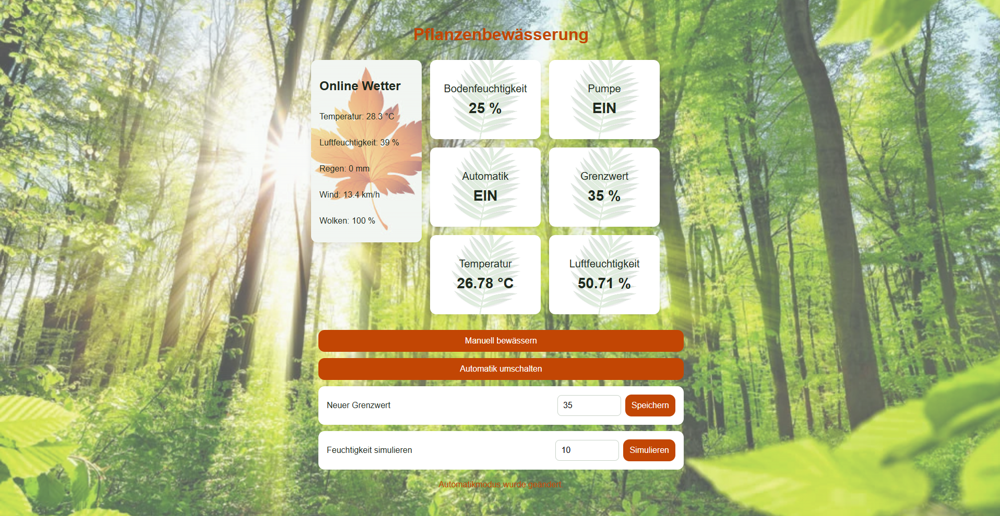

# Pflanzenbewässerung

## Abstract

Dieses Projekt ist eine Webapplikation zur Überwachung und Steuerung einer einfachen Pflanzenbewässerung. Ein Node.js/Express-Server läuft auf einem Raspberry Pi und stellt Sensordaten, Wetterdaten und Steuerfunktionen über eine REST-API bereit. Der Client wird im Webbrowser angezeigt und erlaubt manuelles Bewässern, Automatikbetrieb und das Ändern des Feuchtigkeits-Grenzwerts.

## Projektidee und Ziel

Ziel des Projekts ist es, eine kleine IoT-Anwendung mit Linux, Raspberry Pi, Webserver und Browser-Client umzusetzen. Die Anwendung zeigt die Bodenfeuchtigkeit, den Pumpenstatus, den Automatikmodus, den eingestellten Grenzwert sowie Temperatur- und Luftfeuchtigkeitswerte an. Zusätzlich werden aktuelle Online-Wetterdaten für Basel über die Open-Meteo API angezeigt.

Die Bewässerung kann manuell über einen Button gestartet werden. Im Automatikmodus wird die Bewässerung automatisch aktiviert, wenn die simulierte Bodenfeuchtigkeit unter den definierten Grenzwert fällt.

## Aufbau der Applikation

```text
Webbrowser / Client
        |
        | HTTP Requests
        v
Raspberry Pi / Express Server
        |
        | liest und speichert Zustand
        v
JSON-Datei data.json
        |
        | liest Sensordate       
SHT40 Temperatur-/Luftfeuchtigkeitssensor

Zusätzlich ruft der Server alle 1 stunde aktuelle Wetterdaten von Open-Meteo ab.
```

## Projektstruktur

```text
pflanzenbewasserung/
├── README.md
├── client/
│   ├── pflanzebewaesserung_screen.png
│   ├── index.html
│   ├── main.js
│   ├── style.css
│   └── leavs/
│       ├── leaves.png
│       ├── redleav.png
│       └── waldweb.png
└── server/
    ├── package.json
    ├── yarn.lock
    └── src/
        ├── index.js
        ├── TemLuf_sensor.js
        └── data.json
```

## Screenshot des Clients
```markdown

```

## Serverseitige Applikation

Der Server ist mit Node.js und Express implementiert. Er läuft auf Port `3000` und ist mit `0.0.0.0` so gestartet, dass andere Geräte im gleichen Netzwerk darauf zugreifen können.

Die Datei `server/src/index.js` enthält die Hauptlogik des Servers. Dort werden die API-Endpunkte definiert, der aktuelle Zustand geladen und gespeichert sowie die automatische Bewässerung geprüft. Der Zustand der Anwendung wird in `server/src/data.json` gespeichert. Dadurch bleiben Werte wie Bodenfeuchtigkeit, Grenzwert, Automatikmodus und letzte Bewässerung auch nach einem Neustart erhalten.

Die Datei `server/src/TemLuf_sensor.js` liest über I2C den SHT40 Sensor aus. Dazu wird das Node.js-Modul `i2c-bus` verwendet. Der Sensor liefert Temperatur und relative Luftfeuchtigkeit.

Zusätzlich ruft der Server aktuelle Wetterdaten über die Open-Meteo API ab. Damit nicht bei jedem Client-Update eine externe Anfrage gesendet wird, werden die Wetterdaten für 1 Stunde zwischengespeichert.

## API-Endpunkte

| Methode | Endpunkt         | Beschreibung                                                                                                                                        |
| ------- | ---------------- | --------------------------------------------------------------------------------------------------------------------------------------------------- |
| `GET`   | `/`              | Test-Endpunkt. Gibt zurück, dass der Server läuft.                                                                                                  |
| `GET`   | `/api/status`    | Gibt den aktuellen Zustand der Applikation zurück. Enthält Bodenfeuchtigkeit, Pumpenstatus, Automatikmodus, Grenzwert, Sensordaten und Wetterdaten. |
| `POST`  | `/api/water`     | Startet eine manuelle Bewässerung. Die Pumpe wird für kurze Zeit aktiviert und die Bodenfeuchtigkeit wird erhöht.                                   |
| `POST`  | `/api/auto`      | Schaltet den Automatikmodus ein oder aus. Erwartet JSON mit `autoMode: true` oder `autoMode: false`.                                                |
| `POST`  | `/api/threshold` | Speichert einen neuen Grenzwert für die automatische Bewässerung. Erwartet einen Wert zwischen 0 und 100.                                           |
| `POST`  | `/api/moisture`  | Setzt eine simulierte Bodenfeuchtigkeit. Dieser Endpunkt dient zum Testen der automatischen Bewässerungslogik.                                      |

Beispielantwort von `/api/status`:

```json
{
  "moisture": 45,
  "pumpOn": false,
  "autoMode": true,
  "threshold": 35,
  "lastWatering": "2026-05-30T15:12:50.616Z",
  "temperature": 23.4,
  "humidity": 51.2,
  "weather": {
    "outsideTemperature": 20.1,
    "outsideHumidity": 60,
    "rain": 0,
    "cloudCover": 70,
    "windSpeed": 8.5
  }
}
```

## Clientseitige Applikation

Der Client besteht aus HTML, CSS und JavaScript. Die Datei `client/index.html` enthält die Struktur der Benutzeroberfläche. Die wichtigsten Bereiche sind die Wetterkarte, die Statuskarten und die Steuerbuttons.

Die Datei `client/style.css` definiert das Layout und das Design der Weboberfläche. Es werden Karten verwendet, um die verschiedenen Werte übersichtlich darzustellen. Zusätzlich werden Hintergrundbilder verwendet, damit das Design zum Thema Pflanzen passt.

Die Datei `client/main.js` verbindet den Browser mit dem Server. Sie ruft regelmässig den Endpunkt `/api/status` ab und aktualisiert die angezeigten Werte im DOM. Über Buttons werden POST-Anfragen an den Server gesendet, zum Beispiel für manuelles Bewässern, Automatikmodus oder das Speichern eines neuen Grenzwerts.

Der Client aktualisiert den Status alle 2 Sekunden. Die Online-Wetterdaten werden serverseitig nur alle 1 Stunde neu geladen, damit die externe API nicht unnötig oft aufgerufen wird.

## Inbetriebnahme

### Voraussetzungen

* Raspberry Pi mit Linux
* Node.js und Yarn
* aktivierte I2C-Schnittstelle
* SHT40 Sensor am I2C-Bus
* Browser auf einem Gerät im gleichen Netzwerk

### Server starten

Zuerst in den Server-Ordner wechseln und die Abhängigkeiten installieren:

```bash
cd server
yarn install
```

Danach den Server starten:

```bash
yarn start
```

Der Server ist danach unter Port `3000` erreichbar:

```text
http://<IP-Adresse-des-Raspberry-Pi>:3000
```

Beispiel:

```text
http://192.168.254.253:3000
```

### Client starten

Für den Client kann ein einfacher HTTP-Server verwendet werden. Im Ordner `client` kann zum Beispiel gestartet werden:

```bash
cd client
python3 -m http.server 5500 --bind 0.0.0.0
```

Danach kann der Client im Browser geöffnet werden:

```text
http://<IP-Adresse-des-Raspberry-Pi>:5500
```

Beispiel:

```text
http://192.168.254.253:5500
```

### Wichtiger Hinweis zur IP-Adresse

Der Client verwendet in client/main.js automatisch den Hostnamen der aktuell geöffneten Webseite:

const API_URL = `http://${window.location.hostname}:3000`;

Dadurch muss die IP-Adresse des Raspberry Pi nicht fest im Code eingetragen werden. 

## Fazit

Das Projekt zeigt eine einfache, aber vollständige Webapplikation mit Server, Client, API und Raspberry-Pi-Anbindung. Die Anwendung verbindet lokale Sensordaten mit Online-Wetterdaten und bietet eine einfache Steuerung für manuelle und automatische Pflanzenbewässerung. Dadurch werden zentrale Inhalte des Workshops wie Linux, Webserver, REST-API, JavaScript und Browser-Client praktisch umgesetzt.
